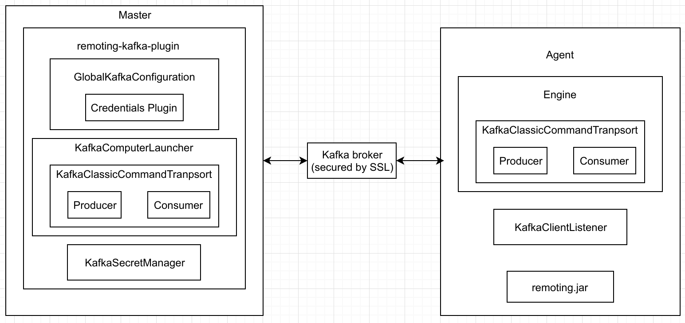

Remoting protocols
====

Remoting library provides extension points, which allow implementing custom communication protocols.
For example, Jenkins project defines its own protocols for the CLI client.

This section describes only the protocols available within the remoting library.

## Active protocols

This section lists all actively maintained protocols offered in Remoting.
There may be other actively maintained protocols in other Jenkins and 3rd-party components.

### JNLP4-connect

* Introduced in: Remoting 3.0, [JENKINS-36871](https://issues.jenkins-ci.org/browse/JENKINS-36871)

This protocol uses the <code>SSLEngine</code> provided by the Java Cryptography Architecture 
  to perform a TLS upgrade of the plaintext connection before any connection secrets are exchanged. 
The subsequent connection is then secured using TLS. 

The encryption algorithms and cyphers used by the <code>SSLEngine</code> when using Oracle JDK 1.8 
   are described in [Java Cryptography Architecture Standard Algorithm Name Documentation for JDK 8](http://docs.oracle.com/javase/8/docs/technotes/guides/security/StandardNames.html))
If stronger algorithms are needed (for example, AES with 256-bit keys), the [JCE Unlimited Strength Jurisdiction Policy Files](http://www.oracle.com/technetwork/java/javase/downloads/index.html)
  can be obtained on Oracle website and installed in the JDK/JRE.

Protocol uses non-blocking I/O wherever possible which removes the performance bottleneck of the <code>JNLP3-connect</code> protocol.

## Deprecated protocols

All protocols below are not recommended for the production use.
They have been deprecated and replaced.

:exclamation: Disclaimer:
Deprecated protocols are not maintained in the Jenkins project.
New bugfix and performance enhancement proposals will be reviewed and probably integrated, 
but confirmed protocol-specific issues will be closed and added to Errata.

### JNLP1-connect

* Status: Replaced by `JNLP2-connect`

The slave sends the master the slave name it wants to register as and the computed HMAC of the slave name.
If accepted the master will reply with a confirmation response.
Then the channel gets established.

#### JNLP1-connect Errata

* NIO is not supported by the protocol.
It may cause performance issues on large-scale instances.

### JNLP2-connect

* Status: Replaced by `JNLP4-connect`

This is the advanced versions of the <code>JNLP1-connect</code> protocol. 
On successful connection to the master the slave will receive a cookie from the master, which the slave stores.
 
If the slave needs to reconnect it will send the same cookie as part of the new connection request. 
The master can use the cookie to determine if the incoming request is an initial connection request 
  or a reconnection and take appropriate action.
  
The protocol supports the non-blocking I/O, which improve the performance of the communication channel.

#### JNLP2-connect Errata

* [JENKINS-31735](https://issues.jenkins-ci.org/browse/JENKINS-31735), [JENKINS-24155](https://issues.jenkins-ci.org/browse/JENKINS-24155) - `NioChannelHub` thread dies sometimes without obvious reason
* ...

The list is not complete. 
Check the bugtracker for more issues. 

### JNLP3-connect

* Status: Replaced by `JNLP4-connect`
* Introduced in: Remoting 2.53, [JENKINS-26580](https://issues.jenkins-ci.org/browse/JENKINS-26580)
* The protocol is disabled by default in Jenkins
* **Not recommended** for use since the <code>JNLP4-connect</code> release

This protocol aims to improve security of JNLP-based slaves. 
Both the master and the slave securely authenticate each other and then setup an encrypted channel.

The protocol does not support non-blocking IO.
For each connection a new thread is being created, and it leads to the performance degradation or
  even Denial of Service on highly loaded Jenkins masters.
There are also some reported issues regarding the Remoting 3 stability on particular systems.

#### JNLP3-connect Errata

Below you can find the list of known `JNLP3-connect` issues.
There is no plan to fix these issues, usage of `JNLP4-connect` is the recommended approach.

* [JENKINS-37302](https://issues.jenkins-ci.org/browse/JENKINS-37302) - 
JNLP3 challenge response generates invalid string encoding, the check may fail randomly.
* [JENKINS-33886](https://issues.jenkins-ci.org/browse/JENKINS-33886) -
On some configurations only one JNLP3 slave per IP address can be connected.
* [JENKINS-34121](https://issues.jenkins-ci.org/browse/JENKINS-34121) -
JNLP3 cannot be used on IBM Java, which doesn't support AES/CTR/PKCS5Padding.

## Plugin protocols

### Remoting Kafka Plugin

* [Remoting Kafka Plugin](https://github.com/jenkinsci/remoting-kafka-plugin) uses Kafka as fault-tolerant communication layer to support command invocation between Jenkins master and agent.
* The plugin gets rid of current direct TCP connection between master and agent.
* Below picture is the overview architecture of the plugin.

## Test Protocols

The protocols below exist for testing purposes only.
It is **not recommended** to use them in production.

### JNLP4-plaintext

* Introduced in: Remoting 3.0, [JENKINS-36871](https://issues.jenkins-ci.org/browse/JENKINS-36871)
* For performance testing **only**, not supported for other purposes
* Cannot be used in Jenkins

This protocol was developed to allow performance comparison 
  between the original NIO engine used by <code>JNLP2-connect</code> and the new NIO engine
  used by <connect>JNLP4-connect</code>.

The protocol is similar to <code>JNLP4-connect</code>, 
  but it does not setup the TLS encryption between agent and master.
As this protocol is plaintext it is not for use outside of like for like performance testing.

